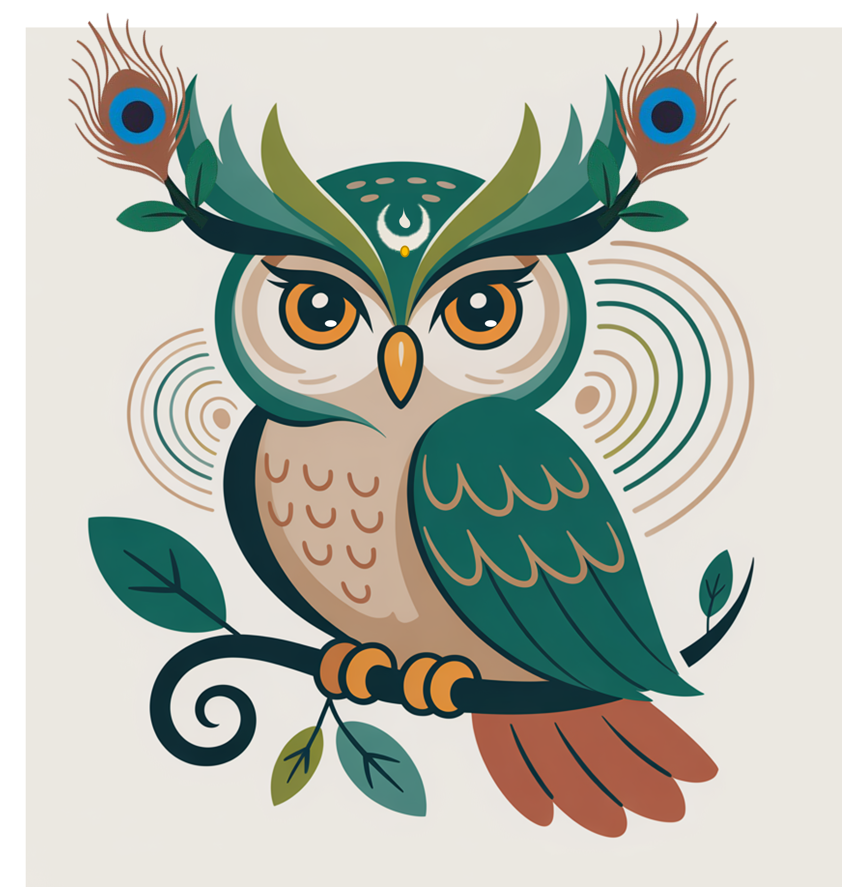

# Drishtamix™ - The Next Generation Social Ecosystem



## Overview

Drishtamix is a revolutionary social media platform that prioritizes originality, environmental consciousness, and meaningful community engagement. Unlike traditional social platforms that reward viral content and trends, Drishtamix focuses on empowering creators, protecting intellectual property, and fostering genuine connections while contributing to real-world environmental impact.

### Key Features

- **🌿 GreenCoin Ecosystem**: Utility-based currency that rewards positive environmental actions
- **🎨 Originality Protection**: AI-powered content scoring and blockchain-based attribution
- **👤 3-in-1 Subprofiles**: Manage Personal, Professional, and Creative identities seamlessly  
- **🏠 MixRooms**: Deep, interest-based community spaces for meaningful engagement
- **📋 Vision Boards**: Collaborative ideation and goal-setting tools
- **🌍 Eco-First Monetization**: Direct support for sustainable businesses and farmers
- **🔒 Privacy & Security**: End-to-end encryption and anti-phishing protection

## Project Structure

```
Drishtamix/
├── pitch.html              # Main presentation file
├── Picture1.png            # Drishtamix mascot (wise owl with peacock feathers)
├── Drishtamix.ico          # Logo icon file
├── BMC.png                 # Business Model Canvas diagram
├── CompetitionMatrix.png   # Competitive analysis matrix
└── README.md              # This file
```

## Technology Stack

- **Frontend**: HTML5, CSS3, Tailwind CSS, JavaScript
- **Backend**: Go, Node.js (Microservices Architecture)
- **Mobile**: Flutter + PWA
- **AI/ML**: LLM-based originality scoring engine
- **Blockchain**: Ethereum/Layer 2 for GreenCoin and NFT licensing
- **Animation**: AOS (Animate On Scroll) library
- **Charts**: Chart.js for data visualization

## Features Breakdown

### 🌱 Environmental Impact
- **Drishti Forests**: Tree-planting initiative powered by user interactions
- **GreenCoin Rewards**: Earn cryptocurrency for real-world eco-actions
- **Farmer Direct Marketplace**: Connect directly with local sustainable producers
- **Carbon Footprint Tracking**: Monitor and offset environmental impact

### 🎯 Creator-First Approach
- **Originality Scoring**: AI algorithms prioritize unique content over trends
- **Content Licensing**: DRM + NFT protection for intellectual property
- **Fair Attribution**: Blockchain-backed creator crediting system
- **Creator Drops**: Exclusive content events from verified original thinkers

### 🤝 Community Building
- **Mode-Based Feeds**: Content adapts to user intent (Learn, Create, Social)
- **Local Discovery**: "OwlMap" feature for nearby creators and events
- **Organization Tools**: Dedicated spaces for teams and communities
- **Real Community Metrics**: Quality engagement over vanity metrics


## Getting Started

1. **View the Pitch**: Open `pitch.html` in your web browser to see the full presentation
2. **Navigate Sections**: Use the navigation menu to explore different aspects of the platform
3. **Interactive Elements**: Click on expandable sections and toggle between problem/solution views

## Business Model

Drishtamix operates on a sustainable multi-revenue model:

- **GreenCoin Ecosystem Revenue**: Transaction fees and marketplace commissions
- **Premium Features**: Pro creator subscriptions and organization accounts
- **Ethical Advertising**: Contextual, opt-in advertising aligned with sustainability values
- **NFT Licensing**: Creator minting and secondary sales royalties
- **Events & Services**: Eco-event hosting and virtual booth rentals

## Competitive Advantage

Unlike existing platforms, Drishtamix offers:

- ✅ **Originality Protection** with AI + Licensing
- ✅ **Eco Monetization** through GreenCoin Ecosystem  
- ✅ **Identity Layers** with 3 Subprofiles
- ✅ **Real Community Tools** via MixRooms & Vision Boards
- ✅ **Multiformat Content** support (Text, Audio, Visual)
- ✅ **Trend Suppression** with non-algorithmic ranking
- ✅ **Earning from Engagement** not just views

## Team Requirements

- **Backend Developer** (Go, Node.js)
- **Frontend Developer** (Flutter, React)
- **UI/UX Expert**
- **AI/ML Engineer**
- **Legal/IP Advisor**

## Contributing

This is a proprietary project under development. The presentation materials are shared for demonstration purposes only.

## Copyright & Licensing

### Project Content
**Drishtamix™** is a trademark of my upcoming project. All rights reserved.

**Drishtamix © 2025 by CKShetty**

Licensed under [Creative Commons Attribution-NonCommercial-NoDerivatives 4.0 International](https://creativecommons.org/licenses/by-nc-nd/4.0/)

[](https://creativecommons.org/licenses/by-nc-nd/4.0/)

### 🚨 **IMPORTANT: Image Rights & Usage**

**ALL IMAGES, GRAPHICS, AND VISUAL ASSETS IN THIS PROJECT ARE ORIGINAL INTELLECTUAL PROPERTY**

- ✅ **Picture1.png** (Drishtamix Mascot) - Original design and concept by CKShetty
- ✅ **Drishtamix.ico** (Logo) - Original trademark design by CKShetty  
- ✅ **BMC.png** (Business Model Canvas) - Original analysis and design by CKShetty
- ✅ **CompetitionMatrix.png** (Competition Analysis) - Original research and visualization by CKShetty

### **🔒 USAGE RESTRICTIONS FOR IMAGES:**

**⚠️ STRICTLY PROHIBITED:**
- Commercial use of any images
- Redistribution or sharing of images
- Modification or derivative works
- Use in other projects or presentations
- Claiming ownership or authorship

**📝 PERMITTED:**
- Viewing for evaluation purposes only
- Academic reference with proper attribution
- Discussion in the context of this project

**⚖️ LEGAL NOTICE:**
These images represent significant creative investment and are protected under copyright law. Any unauthorized use may result in legal action. If you wish to use any visual assets, please contact CKShetty for explicit written permission.

---

## Contact

For questions, collaboration, or licensing inquiries:

- **GitHub**: Contact through repository
- **Support**: [Buy me a coffee](https://buymeacoffee.com/ckshetty)

---

**"See Differently. Share Uniquely."**

*Building a social ecosystem that values originality, rewards environmental action, and fosters genuine human connection.*
